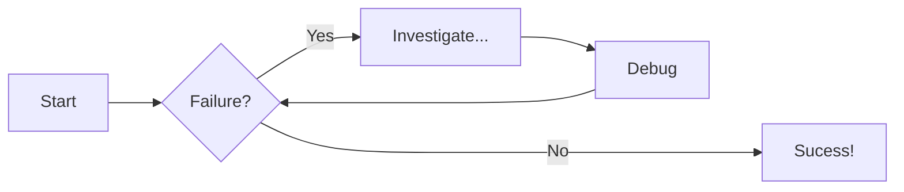
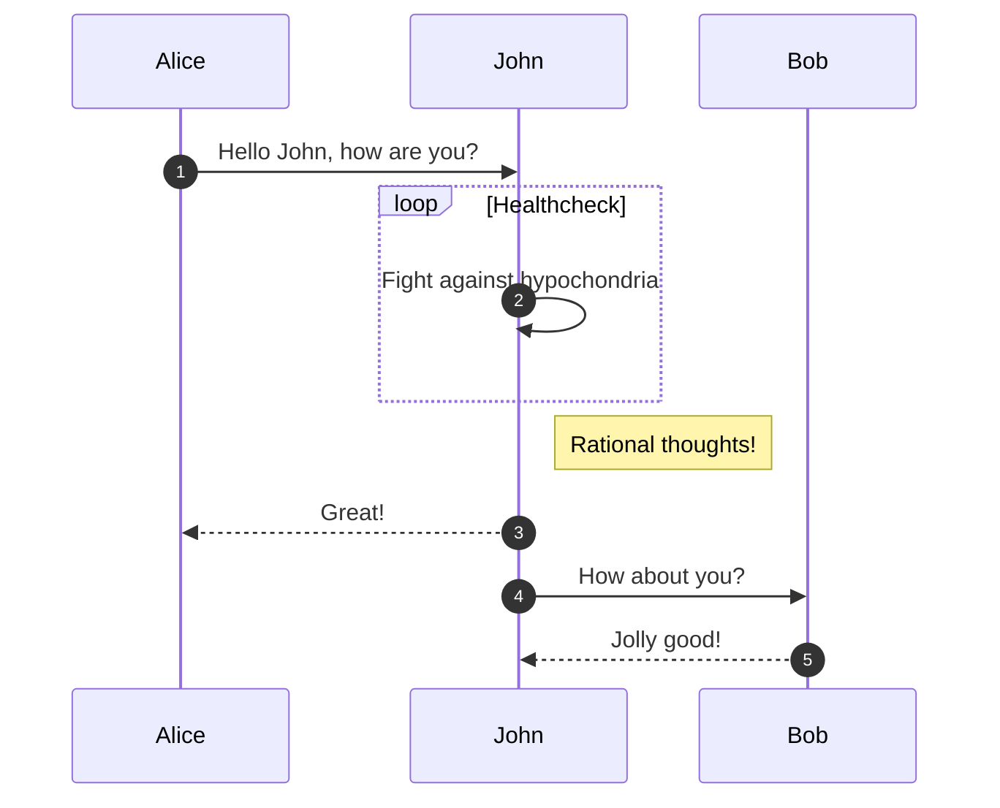

# Diagram Examples

## Flowcharts

```mermaid
graph LR
    A[Start] --> B{Failure?};
    B --> |Yes| C[Investigate...];
    C --> D[Debug];
    D --> B;
    B ----> |No| E[Sucess!];
```

``` mermaid
sequenceDiagram
  autonumber
  Alice->>John: Hello John, how are you?
  loop Healthcheck
      John->>John: Fight against hypochondria
  end
  Note right of John: Rational thoughts!
  John-->>Alice: Great!
  John->>Bob: How about you?
  Bob-->>John: Jolly good!
```